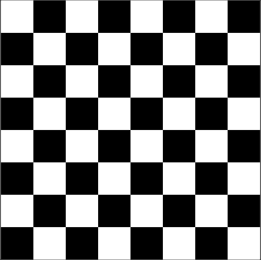
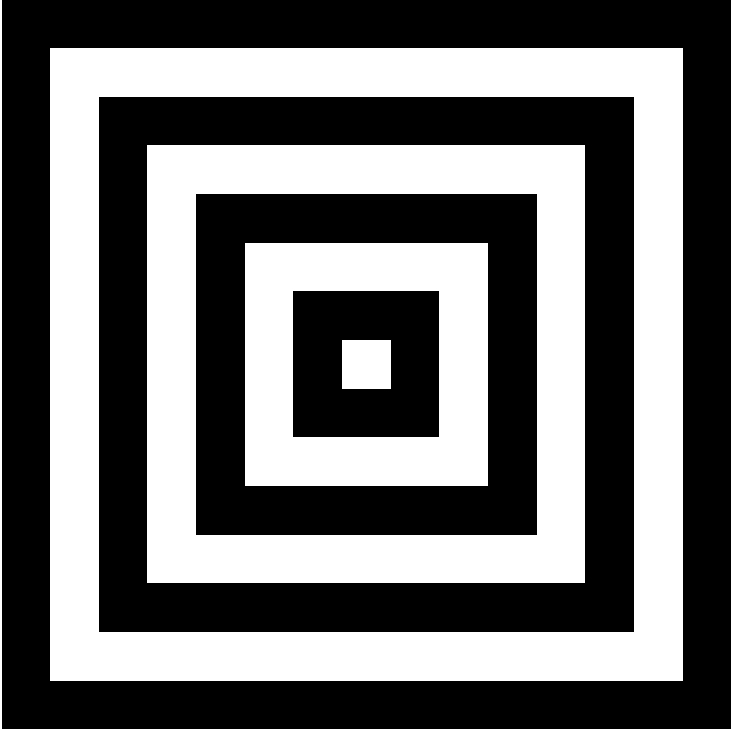
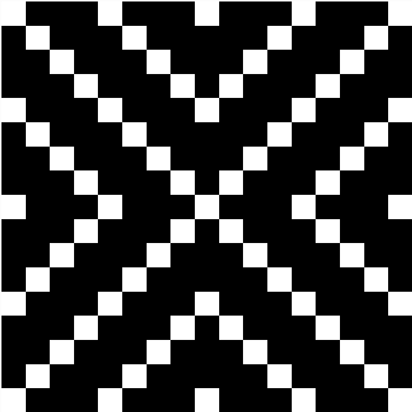
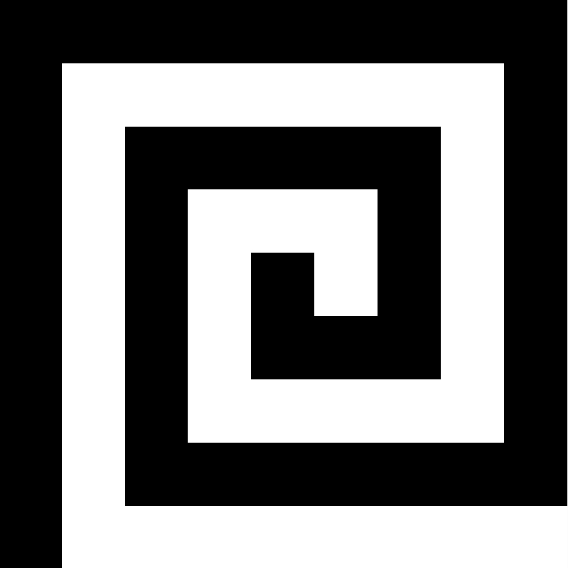

# Bitmaps

Bitmaps are a uncompressed image file format that stores the colour of each individual pixel. We can create our own bitmaps with the Python Image Library (PIL).

## Python Image Library

We will need to import the library before we can use the code:

### Installing
#### Windows / MacOS
Open your terminal and run the folowing command
```python3 -m pip install --upgrade Pillow```

#### Replit
Under the packages tab on the left, search for ```Pillow``` and install the first option (version 9.3.0).

### Importing PIL into your python project
For this week, we will only need the ```Image``` module. To do this, we add ```import PIL.Image``` to the beginning of your python file.

## Creating your image

1. Import PIL.Image with ```import PIL.Image```
2. Define a size variable and assign a value according to the question.
3. Create a variable that stores your image: ```img = PIL.Image.new('RGB', (size, size), "black")```
4. Create another variable that stores the RGB values of the image in a 2D array with ```pixels = img.load()```
5. Now that you can access each pixel in your image as a value in an array, you can either:
   1. Edit specific pixels with ```pixels[column, row] = (R, G, B)```
   2. Use a loop and iterate through all pixels in the image:
        ```
        for column in range(img.size[0]):
            for row in range(img.size[1]):
        ```
6. Finally, export your array of pixels to an output file: ```img.save("output.bmp")```

#### Example:
```
import PIL.Image

size = 25
# PIL accesses images in Cartesian co-ordinates, so it is Image[columns, rows]
img = PIL.Image.new('RGB', (size, size), "black")  # create a new black image
pixels = img.load()  # create the pixel array

for i in range(img.size[0]):  # For every col:
    for j in range(img.size[1]):  # For every row
        if abs(i - j) == 0 or abs(24 - i - j) == 0: # If the current pixel is on the longest diagonal.
            pixels[i, j] = (255, 255, 255)  # set the colour

img.save("output.bmp")
```

## Tasks

### Chessboard
Using the example code above, change the size variable and the condition in the if statement to create a chessboard pattern.


### Boxes
Create the following image with a size of 17px by 17px. Your code should work with any square canvas size with odd side lengths.


### Tiles
Create the following image with a size of 21px by 21px. Your code should work with any square canvas size with odd side lengths.


### Spiral
Create the following image with a size of 17px by 17px. Your code should work with any square canvas size with odd side lengths.
